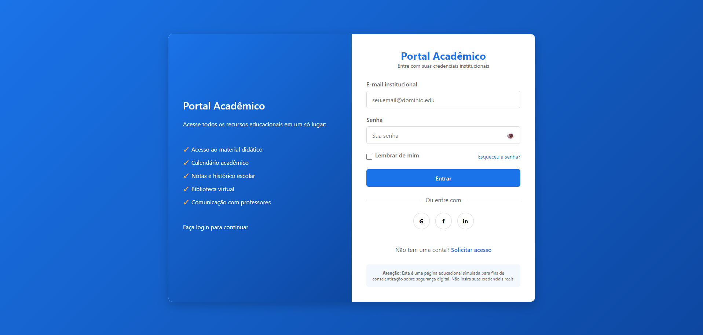
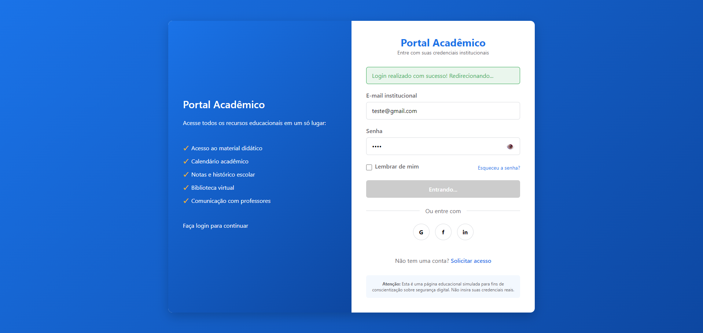
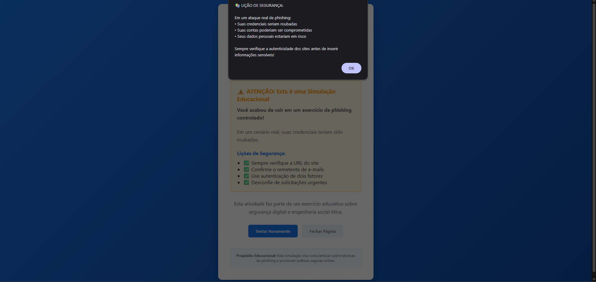
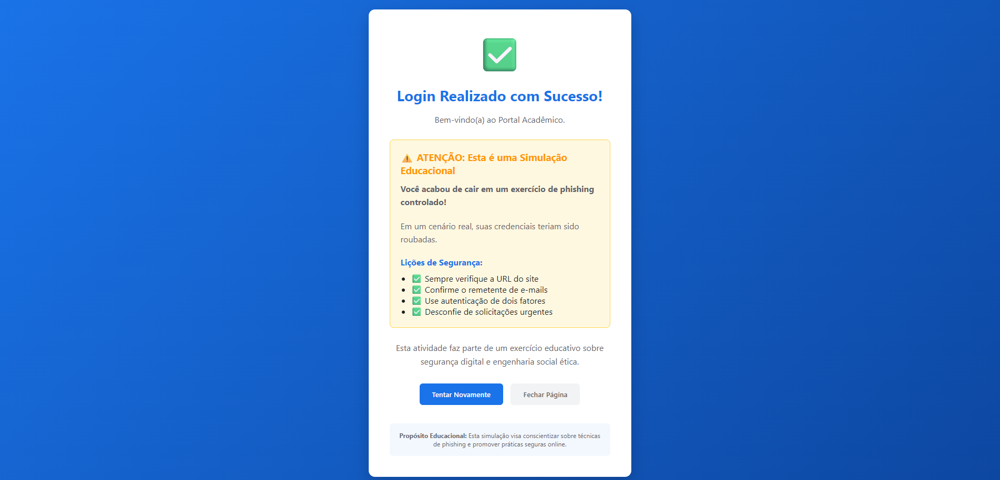

# 🔐 Melt_Engenharia_Social

**🎓 Atividade Prática: Engenharia Social Ética**

[](https://python.org)
[](https://github.com)
[](LICENSE)
[](https://ngrok.com)

---

## 📋 Índice

* [📋 Descrição do Projeto](#-descrição-do-projeto)  
* [🎯 Objetivos Educacionais](#-objetivos-educacionais)  
* [⚠️ Regras Éticas Obrigatórias](#️-regras-éticas-obrigatórias)  
* [🚀 Como Executar o Projeto](#-como-executar-o-projeto)  
  * [🌐 Opção A — GitHub Codespaces](#-opção-a--github-codespaces-recomendado)  
  * [🌐 Opção B — Ngrok (Alternativa Rápida)](#-opção-b--ngrok-alternativa-rápida)  
* [📁 Estrutura do Projeto](#-estrutura-do-projeto)  
* [🔧 Funcionalidades Técnicas](#-funcionalidades-técnicas)  
* [📊 Saída do Sistema](#-saída-do-sistema)  
* [🛡️ Medidas de Segurança Implementadas](#️-medidas-de-segurança-implementadas)  
* [📝 Como Usar na Atividade Prática](#-como-usar-na-atividade-prática)  
* [⚖️ Responsabilidade e Isenção](#-responsabilidade-e-isenção)  
* [🔒 Boas Práticas de Segurança Ensinadas](#-boas-práticas-de-segurança-ensinadas)  
* [📷 Imagens da Aplicação](#-imagens-da-aplicação)  
* [🙋‍♀️ Autoria](#-autoria)  
* [📄 Licença](#-licença)

---

> **⚠️ AVISO IMPORTANTE**
> Este projeto é estritamente para fins educacionais e de conscientização sobre segurança digital.
> **O uso malicioso é expressamente proibido.**

---

## 📋 Descrição do Projeto

Simulação educacional de uma página de **phishing controlada**.
O objetivo é demonstrar técnicas de engenharia social de forma ética, promovendo a **conscientização sobre ataques de phishing**.

---

## 🎯 Objetivos Educacionais

* 📌 Demonstrar como funcionam ataques de phishing
* 📌 Conscientizar sobre verificação de URLs e remetentes
* 📌 Ensinar boas práticas de segurança digital
* 📌 Promover discussões éticas sobre engenharia social

---

## ⚠️ Regras Éticas Obrigatórias

* ✅ **Consentimento obrigatório** – Todos os participantes devem estar cientes da atividade
* ✅ **Dados fictícios apenas** – Uso exclusivo de credenciais falsas
* ✅ **Transparência total** – Explicação do propósito educativo após o teste
* ✅ **Nenhum dado real armazenado** – Credenciais são mascaradas e descartadas
* 🚫 **Proibido uso malicioso** – Apenas para fins educacionais autorizados

---

## 🚀 Como Executar o Projeto

### 🔧 Pré-requisitos

* Python **3.6+**
* Navegador web moderno
* Opção A: Conta GitHub (para Codespaces)
* Opção B: Ngrok instalado (para execução local)

---

### 🌐 Opção A: GitHub Codespaces (Recomendado)

#### Execução Instantânea - Requer Fork

1. Acesse o Repositório e faça o Fork do Repositório:

```bash
https://github.com/LhuanyMotta/Melt_Engenharia_Social
```

2. Abra no Codespaces:

* Clique no botão "Code" verde
* Selecione a aba "Codespaces"
* Clique "Create codespace on main"

3. Execute o Servidor:

```bash
# No terminal do Codespace:
python server.py
```

4. Compartilhe o Link:

* Vá na aba "Ports"
* Porta 8000 → Visibility: Public
* Copie o link (ex: https://abc123-8000.app.github.dev)
* Compartilhe com os participantes

### ✅ Vantagens do Codespaces:

* ✅ Não precisa instalar nada
* ✅ Ambiente pré-configurado
* ✅ Execução imediata
* ✅ Link HTTPS automático
* ✅ Ideal para demonstrações rápidas

---

### 🌐 Opção B: Ngrok (Alternativa Rápida)

#### 🔧 Ativando o Ngrok

O **Ngrok** cria um túnel seguro entre sua máquina local e a internet, permitindo que outras pessoas acessem sua página de simulação.

### 📥 Instalação do Ngrok

#### Opção 1 — Usar o ngrok diretamente na pasta do repositório

```bash
.\ngrok http 8000
```

#### Opção 2 — Adicionar o ngrok ao PATH (para usar de qualquer lugar)

```
1. Se preferir, baixe diretamente em https://ngrok.com/download
2. Extraia o arquivo e adicione ao **PATH** do sistema  
3. Configure o token de autenticação *(opcional, mas recomendado):
> ngrok config add-authtoken SEU_TOKEN_AQUI
```

Se quiser poder digitar apenas `ngrok` em qualquer pasta, siga estes passos (Windows):

1. Mova o `ngrok.exe` para uma pasta permanente, por exemplo:

```
C:\ngrok
```

2. Adicione essa pasta ao `PATH` do Windows:

* Pressione **Win + R**, digite `sysdm.cpl` e pressione Enter.
* Vá em **Avançado → Variáveis de Ambiente**.
* Em **Variáveis do sistema**, selecione **Path → Editar → Novo**.
* Adicione:

```
C:\ngrok
```

* Clique em **OK** em todas as janelas.

3. Feche e reabra o PowerShell, e teste:

```
ngrok version
```

Se tudo estiver certo, aparecerá algo como:

```
ngrok version 3.30.0
```

> Observação: essas instruções cobrem a opção de instalar o ngrok em uma pasta permanente no Windows. Em macOS/Linux, recomenda-se mover o binário para uma pasta do PATH (por exemplo `/usr/local/bin`) e ajustar permissões com `chmod +x ngrok`.

### ✅ Vantagens do Ngrok:

* ✅ Controle total local
* ✅ Links mais curtos
* ✅ Bom para testes prolongados

---

### ▶️ Passo a Passo

**1. Clone o repositório**

```bash
git clone https://github.com/LhuanyMotta/Melt_Engenharia_Social.git
cd Melt_Engenharia_Social
```

**2. Execute o servidor Python**

```bash
# O servidor estará disponível em http://localhost:8000
python server.py
```

**3. Exponha com Ngrok (em outro terminal)**

```bash
ngrok http 8000
```

**4. Compartilhe o link do Ngrok**

```bash
# Use o link HTTPS fornecido pelo Ngrok
# Exemplo: https://abc123-def456.ngrok-free.app
```

---

## 📁 Estrutura do Projeto

```
Melt_Engenharia_Social/
├── server.py              # Servidor principal Python
├── index.html            # Página de login educacional
├── success.html          # Página pós-login educativa
├── login_attempts.json   # Logs de tentativas (automático)
└── README.md            # Este arquivo
```

---

## 🔧 Funcionalidades Técnicas

**1. Captura de Dados (Educacional)**

* **1. Terminal: Exibe credenciais completas para demonstração**
* **2. JSON: Armazena dados mascarados para análise**

**3. Mascaramento automático:**

```
E-mail: t***e@g****.com
Senha: ********
```

**4. Páginas Incluídas:**

* **Página de Login: Simula portal acadêmico legítimo**
* **Página de Sucesso: Explica a simulação e ensina segurança**

**5. Alertas Educativos: Mensagens de conscientização**

---

## 📊 Saída do Sistema

```bash
# No Terminal
📅 Timestamp: 2025-10-04 13:13:34
📧 E-mail: teste@gmail.com
🔑 Senha: 1234
🎭 E-mail mascarado: t***e@g****.com
🎭 Senha mascarada: ********
```

```bash
# No Arquivo JSON

{
      "timestamp": "2025-10-04 13:13:34",
      "email": "t***e@g****.com",
      "password": "********",
      "ip_address": "127.0.0.1"
}
```

---

# 🛡️ Medidas de Segurança Implementadas

## 🔒 Proteção de Dados

* Mascaramento automático de senhas
* E-mails parcialmente ofuscados
* Logs apenas para fins demonstrativos

## 👁️ Transparência

* Avisos visíveis sobre natureza educacional
* Explicação pós-teste obrigatória
* Consentimento explícito necessário

## 🔑 Controle de Acesso

* Uso apenas em ambientes controlados
* Portas locais + Ngrok para testes
* Sem exposição pública direta

---

# 📝 Como Usar na Atividade Prática

### ✅ Com Participantes

1. Obtenha consentimento explícito
2. Explique o propósito educativo
3. Peça para usar credenciais fictícias
4. Execute a simulação
5. Mostre os resultados (dados mascarados)
6. Discuta lições aprendidas

### 💬 Exemplo de Explicação

> Esta é uma simulação educacional sobre phishing. Vou tentar fazer você revelar credenciais fictícias para demonstrar como ataques reais funcionam. Use um e-mail e senha falsos.

---

# ⚖️ Responsabilidade e Isenção

## 🚫 Limitações de Responsabilidade

O desenvolvedor **NÃO** se responsabiliza por:

* Uso malicioso ou não autorizado
* Danos resultantes de uso inadequado
* Violações de políticas institucionais
* Consequências de testes sem consentimento

## ✅ Uso Apropriado

* Apenas em ambientes educacionais
* Com supervisão de instrutor
* Participantes consentintes e informados
* **Credenciais fictícias exclusivamente**

---

# 📘 Boas Práticas de Segurança Ensinadas

* Verifique sempre a URL
* Confirme o remetente de e-mails
* Use autenticação de dois fatores
* Desconfie de solicitações urgentes
* Nunca reuse senhas entre serviços

---

## 📷 Imagens da Aplicação

> 💡 *Demonstrativo do Melt_Engenharia_Social - Página Login*









> 💡 *Demonstrativo doMelt_Engenharia_Social - Terminal*


---

# 🙋‍♀️ Autoria

Desenvolvido por: **Lhuany Motta** [🔗 GitHub](https://github.com/LhuanyMotta)
Versão: **1.0**

---

# 📄 Licença

Este projeto está sob a licença **MIT**.
